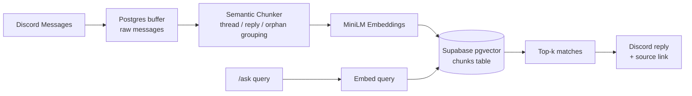

# Discord RAG

Turn a Discord server's message history into a searchable knowledge base — ask a question with `/ask` and get an answer sourced from your community's own conversations, with a link back to the original message.

## What it does

Most Discord knowledge lives in scattered threads, replies, and channels that nobody can search. This bot ingests a server's message history, groups related messages (threads, reply chains, and topically-similar standalone messages) into semantic chunks, embeds them, and stores them in a vector database. A `/ask` slash command then does similarity search over that history and replies with the most relevant passage — plus a jump link to the original Discord message. The bot is accessed either on the web or on Discord as a bot integration. 

## Features

- **Full history ingestion** — walks channel history, active threads, and archived threads on startup, resuming from the last-seen message on restart
- **Semantic chunking** — groups messages by thread, by reply chain, or by embedding similarity for standalone messages, and merges new messages into existing chunks instead of duplicating them
- **Live ingestion loop** — polls for new pending messages every 30s and folds them into the vector store automatically
- **`/ask` slash command** — semantic search over the whole server's history via pgvector cosine/inner-product distance, returned with a source link
- **Thread & reply aware** — understands Discord's conversational structure instead of treating messages as a flat list

## How it works

Ingest — on startup, the bot scrapes a channel's full history (including threads) into a raw Postgres messages table
Chunk — chunker.py groups unprocessed messages by thread/reply/topic and merges them into existing chunks where they extend a prior conversation
Embed & store — chunks are encoded with sentence-transformers/all-MiniLM-L6-v2 and stored in Supabase via pgvector
Query — a question embeds and runs a similarity search over the chunks table, returning the closest matches with a link back to the source message

## Tech Stack

## Project Structure
bot.py             # Discord client, on_ready ingest, /ask command
api.py             # FastAPI backend for the web frontend
frontend/          # React + Vite web UI
ingest.py          # history scraping + pending-message processing loop
buffer.py          # raw message storage (Postgres)
chunker.py         # semantic chunking / merging logic
chunkerhelper.py   # chunk formatting + embedding model
vector_store.py    # pgvector inserts/updates
vector_search.py   # /ask similarity search

